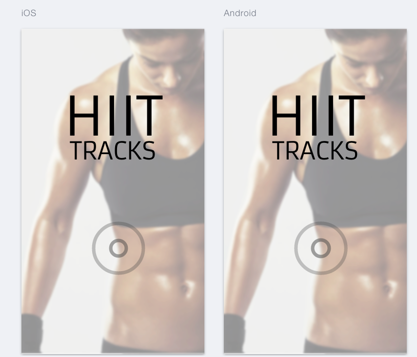
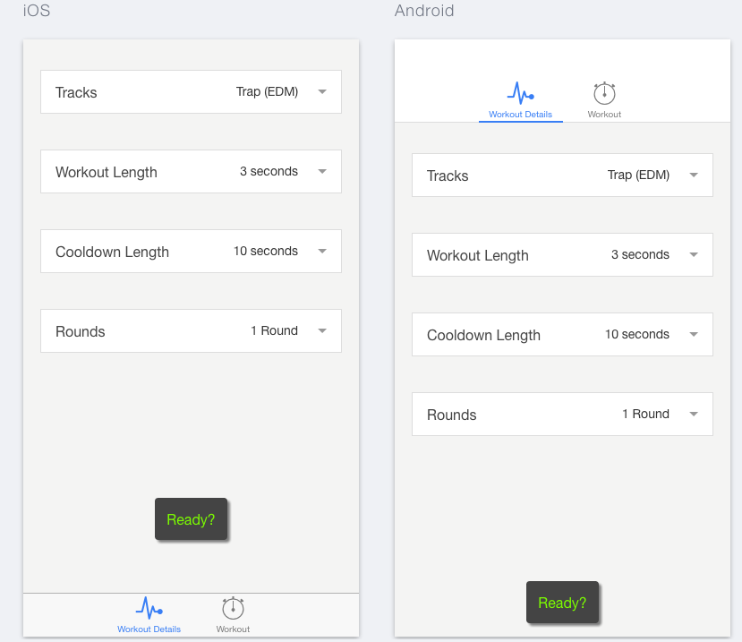
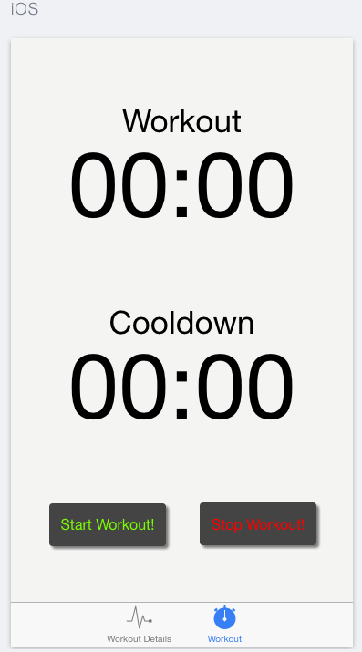
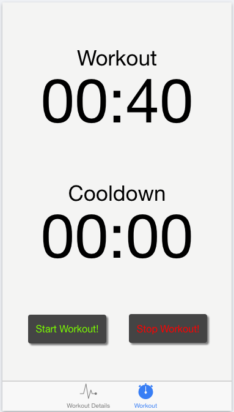
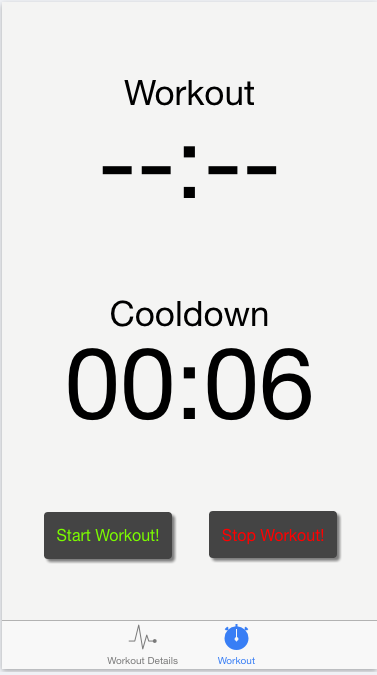

#HIIT Tracks Mobile
=====================

###Overview of the Project
This application was built using the Ionic Framework. HIIT tracks was designed to help time your interval training using a timer and sound ques. The user selects a playlist, the length of workout and cool-down, and how many rounds to go for. When user click ready the workout page is displayed. By clicking on start workout there is a 5 second countdown via audio before the music and timer for the workout begins. The timer will then continue through the cycles while the music is playing. There are audio ques when to workout and when to cool-down. Need to stop the work? Just click on the stop workout button.

##Technologies Used
* HTML
* CSS
* Ionic
* Angular
* JQuery
* JavaScript

###Contributors
* DeeAnn Kendrick
* Cody Barber
* Regan Co

##Things to add
* Ability to add a playlist
* User sign in to keep playlists

###Screenshots

Landing Page

Workout Details - Enter in workout length, cool-down, etc...

Workout Page

Workout Timer

Cool Down Timer
